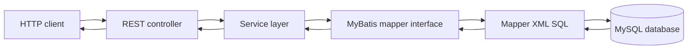

# Testing Project Guide

This document explains the current application, the complete request flow, how to run it, and practical deployment options.

## 1. What This Project Is

This is a Spring Boot REST API built with:

- Java 21
- Spring Boot 4.0.8
- Spring MVC for HTTP endpoints
- MyBatis 4.1.0 for SQL mapping
- MySQL as the database
- Maven Wrapper for repeatable builds
- Lombok for boilerplate getters, setters, and constructors
- Docker for packaging the application as a container

The application exposes two API areas:

- `/api/users`: CRUD operations for users
- `/api/departments`: department data with nested employees, plus a Docker test endpoint

The application starts in `TestingApplication`, where `@SpringBootApplication` enables component scanning, auto-configuration, and the embedded web server.

## 2. Project Structure

```text
Testing/
|-- pom.xml                         Maven build and dependencies
|-- mvnw, mvnw.cmd                  Maven Wrapper scripts
|-- Dockerfile                      Runtime container image definition
|-- src/main/java/com/example/
|   |-- TestingApplication.java     Application entry point
|   |-- controller/                 HTTP/API layer
|   |-- service/                    Business/service layer
|   |-- repository/                 MyBatis mapper interfaces
|   `-- model/                      Request and response objects
|-- src/main/resources/
|   |-- application.properties      Runtime configuration
|   `-- mapper/                     MyBatis XML SQL statements
`-- src/test/java/                  Automated tests
```

`target/` is generated Maven output. It contains compiled classes, copied resources, the packaged JAR, and test reports; it is not the source of truth and should not be deployed from source control.

## 3. Startup Flow

1. Maven compiles the Java 21 source code and copies resources into `target/classes`.
2. Spring Boot starts from `TestingApplication.main()`.
3. `@SpringBootApplication` scans `com.example` and discovers the controllers, services, and MyBatis mapper interfaces.
4. Spring Boot creates the embedded web server on port `8080` by default.
5. The datasource is configured from `spring.datasource.*`.
6. MyBatis loads XML files matching `classpath:mapper/*.xml`.
7. Each mapper XML namespace must match its mapper interface:
   - `UserMapper.xml` -> `com.example.repository.UserMapper`
   - `DepartmentMapper.xml` -> `com.example.repository.DepartmentMapper`
8. Requests are routed to controllers, which call services; services call mapper methods; MyBatis executes SQL against MySQL.



## 4. User API Flow

### Create user

1. Client sends `POST /api/users` with JSON such as:

   ```json
   {
     "name": "Asha",
     "email": "asha@example.com",
     "age": 28
   }
   ```

2. `UserController.createUser()` receives the request body as `UserDto`.
3. `UserService.createUser()` calls `UserMapper.save(user)`.
4. `UserMapper.xml` executes an `INSERT` into `users`.
5. `useGeneratedKeys="true"` places the generated database ID into `user.id`.
6. The controller returns the same DTO, now normally containing the generated ID.

### Read users

- `GET /api/users` calls `UserMapper.findAll()`, selects all users, and orders them by `id`.
- `GET /api/users/{id}` calls `UserMapper.findById(id)` and selects one row.

### Update user

1. Client sends `PUT /api/users/{id}` with the new `name`, `email`, and `age`.
2. The controller overwrites any body ID with the path ID using `user.setId(id)`.
3. The service calls `UserMapper.update(user)`.
4. MyBatis updates the matching row in `users`.
5. The current code returns the request DTO regardless of whether a row was actually updated.

### Delete user

1. Client sends `DELETE /api/users/{id}`.
2. The service calls `UserMapper.deleteById(id)`.
3. The controller always returns `204 No Content` after the mapper call.
4. There is currently no not-found response when the ID does not exist.

## 5. Department API Flow

`GET /api/departments` follows this path:

1. `DepartmentController` delegates to `DepartmentService`.
2. `DepartmentService` calls `DepartmentMapper.findAllDepartments()`.
3. `DepartmentMapper.xml` runs a `LEFT JOIN` between `department` and `employee`.
4. `DepartmentResultMap` maps department columns to `Department` and employee columns to the nested `employees` list.
5. The `LEFT JOIN` means departments without employees can still be returned.

Expected table relationships:

```text
department (id, name)
    |
    | department.id = employee.department_id
    v
employee (id, name, salary, department_id)
```

`GET /api/departments/test` returns the literal string `Testing Docker!!!`. It is a connectivity smoke test, not an application health check.

## 6. Database Contract

The SQL in the repository requires at least these tables and columns:

```sql
CREATE DATABASE testing;
USE testing;

CREATE TABLE users (
    id BIGINT PRIMARY KEY AUTO_INCREMENT,
    name VARCHAR(255),
    email VARCHAR(255),
    age INT
);

CREATE TABLE department (
    id BIGINT PRIMARY KEY AUTO_INCREMENT,
    name VARCHAR(255) NOT NULL
);

CREATE TABLE employee (
    id BIGINT PRIMARY KEY AUTO_INCREMENT,
    name VARCHAR(255),
    salary DECIMAL(12, 2),
    department_id BIGINT,
    CONSTRAINT fk_employee_department
        FOREIGN KEY (department_id) REFERENCES department(id)
);
```

These statements are an inferred minimum schema from the mapper SQL; the project does not currently include database migrations or schema files.

## 7. Configuration

The current `application.properties` configures:

- Application name: `Testing`
- MySQL host: `host.docker.internal`
- Database: `testing`
- Username: `root`
- MyBatis XML location: `classpath:mapper/*.xml`

Important observations:

1. The database password is currently committed in source. Rotate it and remove it from version control before any public or shared deployment.
2. `host.docker.internal` is useful when a container connects to a database running on the Docker host. It is not the normal hostname for a separate production database container or managed database.
3. `spring.jpa.hibernate.ddl-auto=update` has no effect here because this project uses MyBatis and does not include Spring Data JPA. Use migrations such as Flyway or Liquibase instead.
4. No `server.port` is configured, so the application listens on `8080`.

For deployment, override configuration with environment variables rather than editing the JAR:

```text
SPRING_DATASOURCE_URL=jdbc:mysql://db-host:3306/testing?useSSL=true&serverTimezone=UTC
SPRING_DATASOURCE_USERNAME=app_user
SPRING_DATASOURCE_PASSWORD=<secret>
```

Spring Boot maps these environment variables to the corresponding property names automatically.

## 8. Run Locally

Prerequisites:

- JDK 21
- Docker Desktop or a local MySQL server
- A MySQL database named `testing` with the required tables

On Windows PowerShell:

```powershell
./mvnw.cmd clean test
./mvnw.cmd spring-boot:run
```

Then check:

```text
http://localhost:8080/api/departments/test
http://localhost:8080/api/users
http://localhost:8080/api/departments
```

Example user request:

```powershell
Invoke-RestMethod -Method Post `
  -Uri http://localhost:8080/api/users `
  -ContentType 'application/json' `
  -Body '{"name":"Asha","email":"asha@example.com","age":28}'
```

## 9. Build and Run the Existing Dockerfile

The current Dockerfile expects a JAR to already exist in `target/`.

```powershell
./mvnw.cmd clean package -DskipTests
docker build -t testing-api:0.0.1 .
docker run --rm -p 8080:8080 `
  -e SPRING_DATASOURCE_URL='jdbc:mysql://host.docker.internal:3306/testing' `
  -e SPRING_DATASOURCE_USERNAME='app_user' `
  -e SPRING_DATASOURCE_PASSWORD='change-me' `
  --name testing-api testing-api:0.0.1
```

The database must be reachable from the container. When MySQL is another Docker Compose service, use the service name as the hostname, for example `jdbc:mysql://mysql:3306/testing`, not `host.docker.internal`.

## 10. Recommended Production Deployment

The simplest reliable production shape is:

1. Push the source to a Git repository.
2. Provision a managed MySQL database.
3. Create a restricted database user; do not use `root`.
4. Apply the schema through a migration tool or a controlled SQL release step.
5. Build the JAR or Docker image in CI.
6. Deploy the container to a platform such as AWS App Runner, Azure Container Apps, Google Cloud Run, Render, Railway, or Fly.io.
7. Set datasource values as platform secrets/environment variables.
8. Expose port `8080` and configure the platform health check to use an endpoint that does not require database access, or add a proper Actuator health endpoint.
9. Restrict the database firewall to the application network.
10. Configure HTTPS, logs, backups, monitoring, and a rollback strategy.

For a small service, a managed MySQL database plus a container platform is preferable to running both the application and MySQL on one unprotected virtual machine. For a controlled VM deployment, install Java 21 or run Docker, place the service behind Nginx or a cloud load balancer, and run it under systemd or a container restart policy.

## 11. Production Hardening Checklist

- Remove and rotate the committed database password.
- Add `.env` or platform-secret configuration only through deployment tooling; never commit secrets.
- Add request validation with `@Valid` and constraints such as `@NotBlank`, `@Email`, and `@Min`.
- Add consistent exception handling with `@RestControllerAdvice` for not-found, validation, and database errors.
- Check mapper affected-row counts so update/delete can return `404` when appropriate.
- Add authentication and authorization before exposing user data publicly.
- Use a non-root database account with only the required permissions.
- Add Flyway or Liquibase migrations and remove reliance on manually prepared tables.
- Add integration tests for each endpoint against a disposable MySQL/Testcontainers database.
- Add a real health endpoint and structured logging.
- Add pagination for `GET /api/users` when the table can grow.
- Review CORS, TLS, request size limits, and database connection pool settings.

## 12. Current Test Coverage and Gaps

The only test is `TestingApplicationTests.contextLoads()`. It confirms that the Spring application context can start, but it does not prove that:

- the database is reachable;
- mapper XML statements are correct against a real schema;
- CRUD endpoints return the intended status codes;
- department-to-employee nesting works;
- validation and error handling work.

A useful next testing layer is controller/service integration coverage for the five user operations and the department query, using Testcontainers MySQL so the SQL is executed against a real MySQL instance.

## 13. End-to-End Summary

```text
Client
  -> HTTP request
  -> Spring MVC controller
  -> service class
  -> MyBatis mapper interface
  -> mapper XML statement
  -> MySQL table/query
  -> mapped Java model
  -> JSON HTTP response
```

The application is structurally small and deployable as a Java 21 JAR or Docker container. The most important work before production is secret removal, database migration management, endpoint validation/error handling, authentication, and real integration-test coverage.